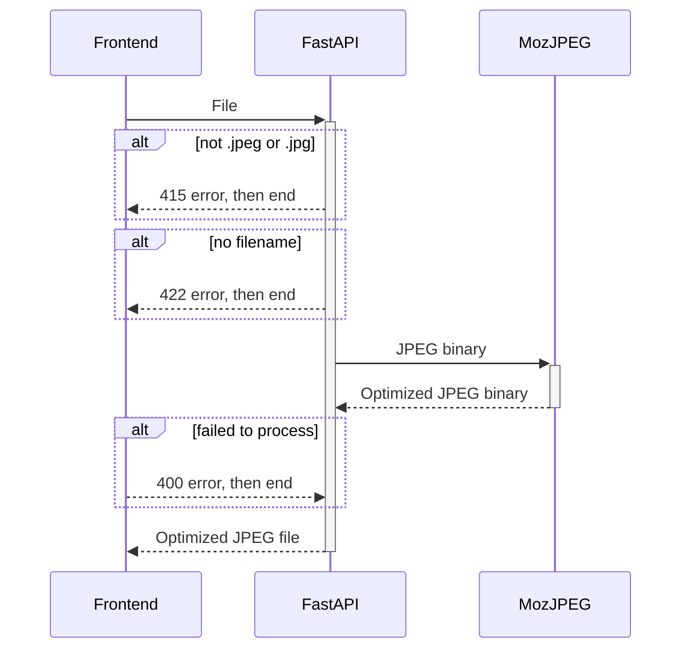
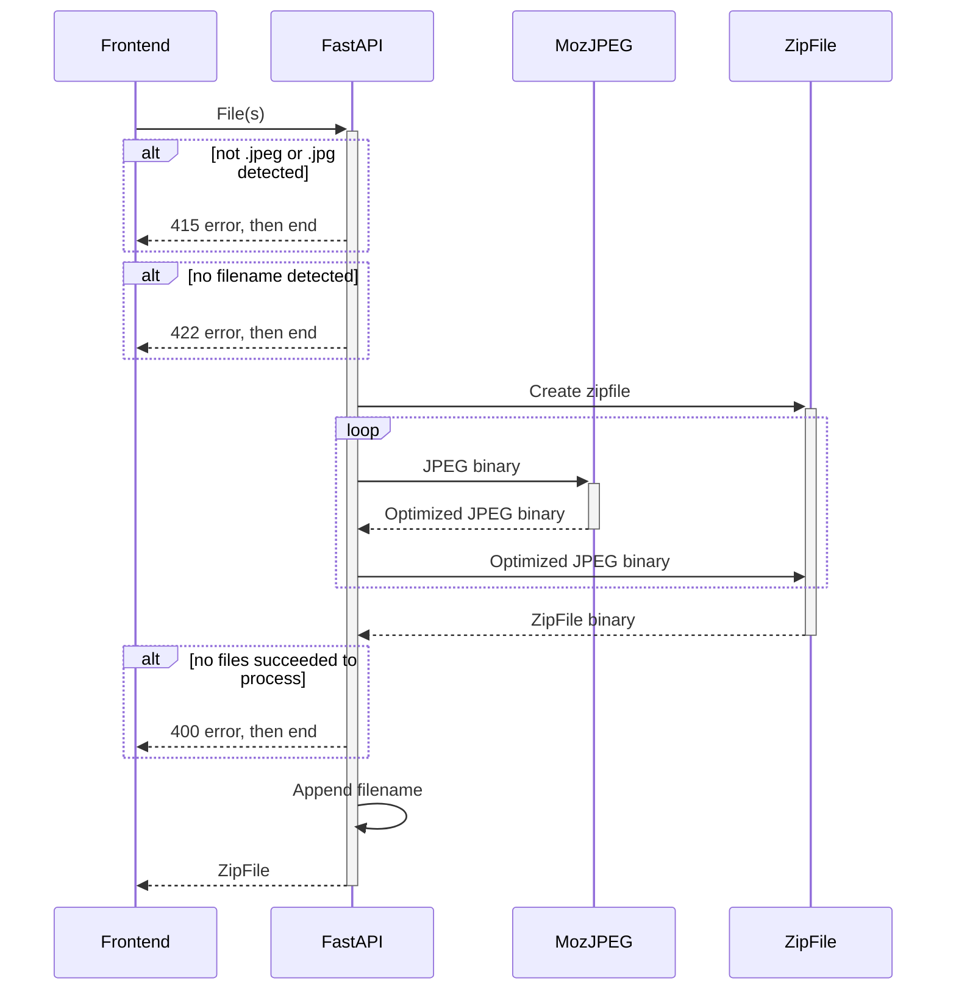

# Backend sequence

## Single file processing

```mermaid
sequenceDiagram
  participant C as Frontend
  participant M as FastAPI
  participant MJ as MozJPEG

  C ->>+ M: File

  alt not .jpeg or .jpg
    M -->> C: 415 error, then end
  end

  alt no filename
    M -->> C: 422 error, then end
  end

  M ->>+ MJ: JPEG binary
  MJ -->>- M: Optimized JPEG binary

  alt failed to process
    C -->> M: 400 error, then end
  end

  M -->>- C: Optimized JPEG file
```

## Multiple files processing

```mermaid
sequenceDiagram
  participant C as Frontend
  participant M as FastAPI
  participant MJ as MozJPEG
  participant ZF as ZipFile

  C ->>+ M: File(s)

  alt not .jpeg or .jpg detected
    M -->> C: 415 error, then end
  end

  alt no filename detected
    M -->> C: 422 error, then end
  end

  M ->>+ ZF: Create zipfile
  loop
    M ->>+ MJ: JPEG binary
    MJ -->>- M: Optimized JPEG binary
    M ->> ZF: Optimized JPEG binary
  end
  ZF -->>- M: ZipFile binary

  alt no files succeeded to process
    M -->> C: 400 error, then end
  end

  M ->> M: Append filename
  M -->>- C: ZipFile
```
