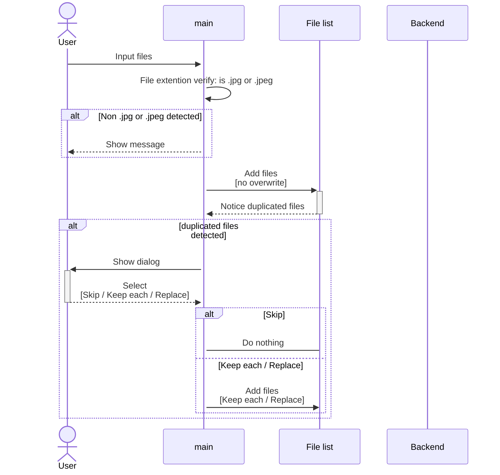
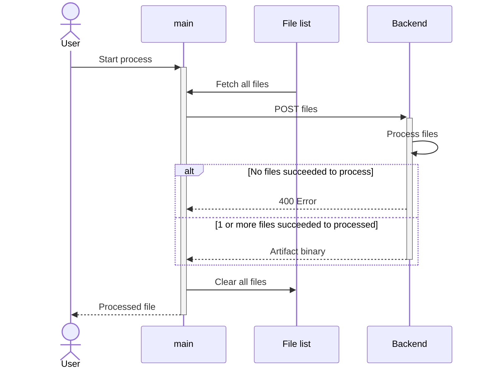

# Frontend sequence

## Files input

```mermaid
sequenceDiagram
  actor U as User
  participant M as main
  participant L as File list
  participant B as Backend

  U ->>+ M: Input files
  M ->> M: File extention verify: is .jpg or .jpeg

  alt Non .jpg or .jpeg detected
    M -->> U: Show message
  end

  M ->>+ L: Add files<br>[no overwrite]
  L -->>- M: Notice duplicated files

  alt duplicated files detected
    M ->>+ U: Show dialog
    U -->>- M: Select<br>[Skip / Keep each / Replace]

    alt Skip
      M -> L: Do nothing
    else Keep each / Replace
      M ->> L: Add files<br>[Keep each / Replace]
    end
  end
```

## Start process

```mermaid
sequenceDiagram
  actor U as User
  participant M as main
  participant L as File list
  participant B as Backend

  U ->>+ M: Start process

  L ->>M: Fetch all files

  M ->>+ B: POST files
  B ->> B: Process files

  alt No files succeeded to process
    B -->> M: 400 Error
  else 1 or more files succeeded to processed
    B -->>- M: Artifact binary
  end

  M ->> L: Clear all files

  M -->>- U: Processed file
```
